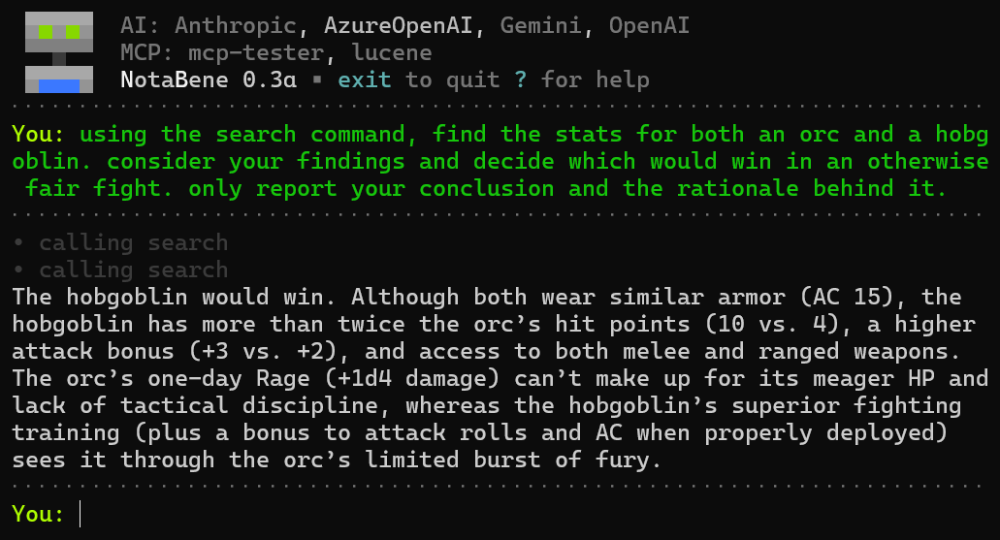

# NotaBene (nb)

A feature-rich AI CLI.



## Features

- **Multi-Provider AI Support**: Built-in support for Azure OpenAI, OpenAI, Anthropic Claude, and Google Gemini. Bring any Microsoft.Extensions.AI compatible model.
- **Interactive and Single-Shot Modes**: Use interactively or execute single commands. Conversation history is stored per-directory, so single-shot mode preserves context between invocations.
- **File Insertion** (PDF, TXT, MD, JPG, PNG) with multimodal support for vision-capable models
- **MCP Server Integration** for extensible tools and prompts

## Prerequisites

- .NET 8.0 or later
- API key for at least one supported AI provider:
  - Azure OpenAI
  - OpenAI
  - Anthropic Claude
  - Google Gemini

## Setup

1. Clone and configure:
   ```bash
   git clone https://github.com/breitreiter/nb
   cd nb
   cp appsettings.example.json appsettings.json
   ```

2. Edit `appsettings.json` with your AI provider configuration. You can configure multiple providers and switch between them at runtime, but you only need to start with one.

3. Optionally edit `system.md` to enrich the default system prompt.

4. Optionally configure MCP servers by copying `mcp.example.json` to `mcp.json` and editing.

5. Build and run:
   ```bash
   dotnet build
   dotnet run
   ```

## Usage

### Interactive Mode
Launch with no parameters to start an interactive chat session:
```bash
nb
```
In interactive mode, you can use these commands:
- `exit` - Quit the application
- `/clear` - Clear conversation history (preserves system prompt)
- `/insert <filepath>` - Insert file content into conversation context (PDF, text, JPG, PNG)
- `/providers` - List all available AI providers and their configuration status
- `/provider <name>` - Switch to a different AI provider (e.g., `/provider Anthropic`)
- `/prompts` - List available MCP prompts from connected servers
- `/prompt <name>` - Invoke a specific MCP prompt with interactive argument collection
- `?` - Show help with all commands

### Single-Shot Mode
Launch with parameters to execute a single command and exit immediately:
```bash
# Send a chat message and exit
nb What is the capital of France?

# Execute a command and exit
nb /clear
nb /insert document.pdf
nb Summarize this document
```

Conversation history saves to `.nb_conversation_history.json` in the current working directory. Each directory maintains its own context, and single-shot mode maintains conversation continuity between invocations.

### Provider Switching
Switch between AI providers during a conversation to leverage different models' strengths:
```bash
/providers                 # List all available providers
/provider Anthropic        # Switch to Claude
```

Conversation history is maintained when switching providers, allowing you to continue the same conversation with different AI models.

### MCP Prompts
List and invoke prompts from connected MCP servers:
```bash
/prompts                    # List available prompts
/prompt weather-report      # Invoke a specific prompt
```
Prompts may request arguments interactively before execution.

### Built-in MCP Server
The project includes a test server (`mcp-servers/mcp-tester/`) with basic tools and dynamically generated prompts from markdown files.

### Fake Tools
nb will read fake-tools.yaml and treat those definitions as normal tools. When the model requests a fake tool, nb will return the static response configured in the yaml file. 

Fake tool definitions will override MCP definitions. This is by design, to allow you to fake destructive actions or quickly tune tool descriptions for alignment testing.

## Theming

nb loads its color scheme from `theme.json` at startup. Color names are from [Spectre.Console](https://spectreconsole.net/appendix/colors)

For example, here's a high-contrast theme (WCAG AAA on standard Windows console background #0C0C0C):

```json
{
  "Success": "lime",
  "Error": "red",
  "Warning": "yellow",
  "Info": "white",
  "Muted": "grey70",
  "Accent": "aqua",
  "UserPrompt": "lime",
  "FakeTool": "magenta"
}
```

## Building for Distribution

```bash
dotnet publish -c Release -r win-x64 --self-contained
```

Include `system.md`, `mcp.json`, and `theme.json` with your executable for custom configurations.

## AI Provider Architecture

nb includes four built-in AI providers and supports extensibility for additional services:

### Built-in Providers
- **Azure OpenAI** - Microsoft's enterprise OpenAI service
- **OpenAI** - Direct OpenAI API integration
- **Anthropic** - Claude models with function calling support
- **Google Gemini** - Google's generative AI models

All providers are automatically compiled into the `bin/{Config}/net8.0/providers/` directory during build.

### Provider Extensibility

nb uses a pluggable provider architecture built on Microsoft.Extensions.AI. The repo includes 4 common providers, but you can roll your own.

1. You'll need to create your own project, includind a class which implements the `IChatClientProvider` interface from nb.Providers.Abstractions. That interface requires you to supply an instance of `IChatClient` from Microsoft.Extensions.AI, plus some basic tooling for configuration.
2. Copy your built assembly to a new subdirectory under `providers/`
3. If necessary, add any required configuration to appsettings.json. Since you had to DIY the configuration in step 1, you should know what you need to add.

## License

MIT License
