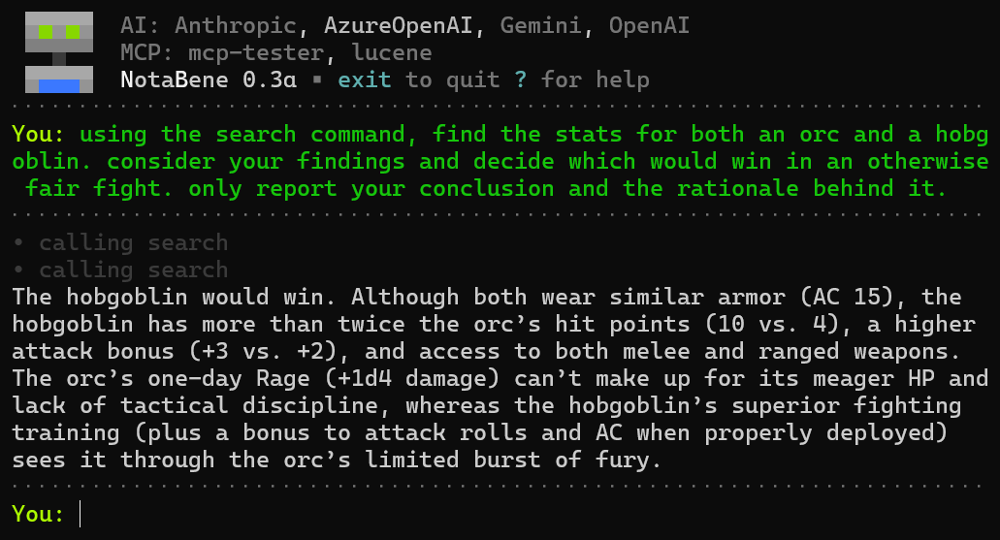

# NotaBene (nb)

A terminal-native AI assistant with deep shell integration, project context awareness, and extensible tooling.



## Features

- **Multi-Provider AI Support**: Built-in support for Azure OpenAI (Chat Completions and Responses API), OpenAI, Anthropic Claude, and Google Gemini. Bring any Microsoft.Extensions.AI compatible model.
- **Interactive and Single-Shot Modes**: Use interactively or execute single commands. Conversation history is stored per-directory, so single-shot mode preserves context between invocations.
- **Terminal Integration**: Native shell access with approval UX. Models can execute commands, with dangerous operations requiring explicit confirmation.
- **Native File Tools**: Cross-platform `read_file`, `write_file`, `edit_file`, `find_files`, `grep`, `list_dir`, and `fetch_url` — read-only tools auto-approve within the working directory.
- **Trust Mode**: `--trust` auto-approves file tools and safe shell commands within the working directory sandbox.
- **File Insertion** (PDF, TXT, MD, JPG, PNG) with multimodal support for vision-capable models
- **MCP Server Integration** for extensible tools and resources
- **Kit System**: Activate contextual prompts and MCP tools with `+` disambiguation (e.g., `+review`, `+testing`)
- **Line Editor**: Full editing capabilities with history, backslash continuation, and `/edit` for composing in `$EDITOR`
- **Project Context**: Auto-loads `NB.md` from your working directory to provide project-specific context

## Prerequisites

- .NET 8.0 or later
- API key for at least one supported AI provider:
  - Azure OpenAI
  - OpenAI
  - Anthropic Claude
  - Google Gemini

## Installation

### Requirements

- .NET 8 SDK (to build from source) or .NET 8 runtime (for pre-built binaries)
- **Windows only:** [Git for Windows](https://git-scm.com/download/win) — nb uses Git Bash for its shell tool on Windows. PowerShell is not supported, because models mix bash and PowerShell idioms when given a tool named `bash` and produce broken commands. If `bash.exe` isn't found at install time, nb will tell you where to get it.

### Option 1: Build from Source (Recommended)

1. Clone and configure:
   ```bash
   git clone https://github.com/breitreiter/nb
   cd nb
   cp appsettings.example.json appsettings.json
   ```

2. Edit `appsettings.json` with your AI provider configuration.

3. Build and run:
   ```bash
   dotnet build
   cd bin/Debug/net8.0
   ./nb
   ```

   **Note:** nb must run from the bin directory where provider DLLs are located.

### Option 2: Pre-built Binaries

Pre-built binaries are available in the [releases section](https://github.com/breitreiter/nb/releases), but they are not code-signed. This means you'll encounter security warnings on both Windows and macOS.

#### Windows

Windows Defender SmartScreen will warn you about running an unsigned application. Click "More info" then "Run anyway" to proceed. See Microsoft's [SmartScreen documentation](https://learn.microsoft.com/en-us/windows/security/operating-system-security/virus-and-threat-protection/microsoft-defender-smartscreen/) for more information.

#### macOS

macOS Gatekeeper will block unsigned applications. See Apple's guide on [safely opening apps on your Mac](https://support.apple.com/en-us/102445) for instructions on how to run unsigned applications.

## Configuration

After installation, configure nb for your environment:

1. **AI Provider**: Edit `appsettings.json` with your API keys and endpoints. You can configure multiple providers and switch between them at runtime, but you only need to start with one.

2. **System Prompt** (Optional): Edit `system.md` to customize the default system prompt.

3. **MCP Servers** (Optional): Copy `mcp.example.json` to `mcp.json` and configure your MCP server connections.

4. **Kits** (Optional): Copy `kits.example.json` to `kits.json` and configure contextual prompt bundles.

5. **Theme** (Optional): Customize colors by editing `theme.json`.

## Usage

### Interactive Mode
Launch with no parameters to start an interactive chat session:
```bash
nb
```

In interactive mode, you can:
- Type naturally to chat with the AI
- Type `+` to activate kits (contextual prompt/tool bundles)
- Type `/` to see available slash commands
- Type `//` to cancel and go back
- Use backslash (`\`) at end of line to continue on next line
- Press up/down arrows for command history

### Slash Commands

| Command | Description |
|---------|-------------|
| `/clear` | Clear conversation history (preserves system prompt) |
| `/edit` | Compose message in `$EDITOR` |
| `/provider` | Switch AI provider |
| `/quit` | Exit nb |

### Single-Shot Mode
Launch with parameters to execute a single command and exit immediately:
```bash
nb /clear
nb Summarize this document
```

Text piped to stdin is treated as conversation context. nb will read stdin to completion before continuing.
```bash
echo "the air in spring is fresh and clean" | nb "write a sentence that rhymes with this, to create a couplet"
```

Conversation history saves to `.nb_conversation_history.json` in the current working directory. Each directory maintains its own context, and single-shot mode maintains conversation continuity between invocations.

nb exposes the current working directory as an MCP root, to help filesystem MCP servers orient themselves.

### Shell Commands

Models can execute shell commands via the built-in `bash` tool. Each command requires approval before execution:

```
Run: ls -la
Execute? [Y/n/?]
```

Commands are classified for clarity (`Read`, `Write`, `Delete`, `Run`) and dangerous operations show warnings with flipped defaults:

```
Delete ⚠: /tmp/important-file
  Warning: deletes files
Execute? [y/N/?]
```

Press `?` at the approval prompt to see the full command before deciding.

For automation and scripting, pre-approve commands with the `--approve` flag:
```bash
nb --approve "ls" --approve "cat *" "analyze this project"
```

Patterns support globs (`cat *` matches `cat file.txt`, `cat /etc/hosts`, etc.).

**Auto-approved safe commands** (no prompt required):
- Build tools: `dotnet build`, `dotnet test`, `cargo build`, `make`, `npm run`, `yarn`, etc.
- Read-only git: `git status`, `git log`, `git diff`, `git show`, etc.
- Read-only queries: `which`, `whereis`, `type`, etc.

### File Tools

Models have native file tools that work cross-platform without the shell:

| Tool | Description | Approval |
|------|-------------|----------|
| `read_file` | Read file contents with line numbers | Auto in cwd, prompt outside |
| `list_dir` | Lightweight directory listing | Auto in cwd, prompt outside |
| `find_files` | Glob-based file discovery | Auto in cwd, prompt outside |
| `grep` | Regex content search | Auto in cwd, prompt outside |
| `write_file` | Create or overwrite files | Required (auto in cwd with `--trust`) |
| `edit_file` | Targeted string replacement | Required (auto in cwd with `--trust`) |
| `fetch_url` | Fetch text content from an HTTP/HTTPS URL | Always required |

Read tools auto-approve inside the working directory sandbox (and system temp dirs); paths outside prompt for approval. Write tools always prompt unless `--trust` is active. `fetch_url` always prompts — outbound network is a separate trust boundary.

**Read-before-edit guard**: The `edit_file` and `write_file` tools enforce that files must be read via `read_file` before modification, helping prevent the model from making blind edits.

### Trust Mode

Auto-approve file tools and non-dangerous shell commands within the working directory:

```bash
nb --trust "refactor the auth module"
```

Or enable permanently in `appsettings.json`:
```json
{ "Trust": true }
```

**Sandboxed**: only operations targeting the cwd (and system temp dirs) are auto-approved. Dangerous commands (`rm -rf`, `sudo`, etc.) always prompt. Also bumps the max tool calls per message to 50.

### Kits

Kits are contextual prompt bundles that inject domain-specific guidance and optionally gate MCP server tools. Configure in `kits.json`:

```json
{
  "kits": {
    "review": {
      "description": "Code review guidance",
      "prompt": "Focus on code quality, correctness, security vulnerabilities, and maintainability..."
    },
    "testing": {
      "description": "Testing and QA",
      "prompt": "Help write and run tests...",
      "mcpServers": ["test-runner"]
    }
  }
}
```

Activate during conversation by typing `+` and selecting from the menu. When a kit is active:
- Its prompt is injected into context
- Any MCP servers specified in `mcpServers` are made available
- MCP tools from non-active kits are hidden

**MCP gating**: If you have kits configured, MCP tools are only available when their server is listed in an active kit's `mcpServers` array. This prevents tool clutter and helps focus the model.

### Command-Line Flags

| Flag | Description |
|------|-------------|
| `--approve <pattern>` | Pre-approve shell commands matching the glob pattern |
| `--trust` | Auto-approve file tools and safe bash commands within cwd |
| `--system <path>` | Load system prompt from a custom file |
| `--nobash` | Disable all shell and file tools |
| `--verbose` | Log tool call inputs and outputs (useful for debugging) |
| `--dump-tools` | Write MCP tool manifest to `mcp-tools.json` and exit |

Example combining flags:
```bash
nb --verbose --nobash --system eval-prompt.txt "run the evaluation"
```

### Provider Switching
Switch between AI providers during a conversation to leverage different models' strengths:
```bash
/provider                 # Interactive selection menu
```

Conversation history is maintained when switching providers, allowing you to continue the same conversation with different AI models.

### MCP Configuration
Configure MCP servers in `mcp.json`:
```json
{
  "servers": {
    "my-server": {
      "type": "stdio",
      "command": "my-mcp-server",
      "args": ["--some-flag"],
      "alwaysAllow": ["tool1", "tool2"]
    }
  }
}
```

The `alwaysAllow` array specifies tools that skip approval prompts. Use `["*"]` to auto-approve all tools from a server (useful for automation):
```json
"alwaysAllow": ["*"]
```

### Built-in MCP Server
The project includes a test server (`mcp-servers/mcp-tester/`) with basic tools.

### Fake Tools
nb will read `fake-tools.yaml` and treat those definitions as normal tools. When the model requests a fake tool, nb will return the configured response. Refer to `fake-tools.example.yaml` for the expected format.

Fake tool definitions will override MCP definitions. This is by design, to allow you to fake destructive actions or quickly tune tool descriptions for alignment testing.

#### Response Macros
Responses support macros for dynamic values, so each invocation produces fresh data instead of identical static strings:

| Macro | Description | Example |
|-------|-------------|---------|
| `{{$guid}}` | Random UUID | `a3b1c2d4-...` |
| `{{$timestamp}}` | Current UTC time (ISO 8601) | `2026-02-25T14:30:00Z` |
| `{{$int}}` | Random integer | `483291` |
| `{{$int(1,100)}}` | Random integer in range | `42` |
| `{{$counter.name}}` | Auto-incrementing counter | `1`, `2`, `3`... |
| `{{$param.fieldname}}` | Echo back a tool argument | value of `fieldname` |
| `{{$choice(a,b,c)}}` | Random pick from list | `b` |
| `{{$random_string}}` | Random alphanumeric (8 chars) | `xK9mPq2r` |
| `{{$random_string(16)}}` | Random alphanumeric (custom length) | `xK9mPq2rT5nLw8yZ` |

Example response template:
```yaml
response: '{"id": "{{$guid}}", "status": "{{$choice(pending,active,completed)}}", "created_at": "{{$timestamp}}"}'
```

## Project Context

If you create an `NB.md` file in your working directory, nb will automatically load it and include it in the system prompt. This is perfect for providing project-specific context, coding conventions, architecture notes, or any other information the AI should know about your project.

nb will search upward through parent directories to find `NB.md`, so you can place it at your project root and it will be available in subdirectories.

Other context files may be hinted at if found (e.g., `CLAUDE.md`, `AGENTS.md`), but only `NB.md` auto-loads.

## Theming

nb loads its color scheme from `theme.json` at startup. Color names are from [Spectre.Console](https://spectreconsole.net/appendix/colors)

For example, here's a high-contrast theme (WCAG AAA on standard Windows console background #0C0C0C):

```json
{
  "Success": "lime",
  "Error": "red",
  "Warning": "yellow",
  "Info": "white",
  "Muted": "grey70",
  "Accent": "aqua",
  "UserPrompt": "lime",
  "FakeTool": "magenta"
}
```

## Building for Distribution

```bash
dotnet publish -c Release -r win-x64 --self-contained
```

Include `system.md`, `mcp.json`, `kits.json`, and `theme.json` with your executable for custom configurations.

## AI Provider Architecture

nb includes several built-in AI providers and supports extensibility for additional services:

### Built-in Providers
- **AzureOpenAI** - Chat Completions on classic Azure OpenAI resources
- **AzureFoundry** - Responses API on classic Azure OpenAI resources (needed for codex-family models like `gpt-5-codex`, and any other Responses-API-only model)
- **OpenAI** - Direct OpenAI API integration
- **Anthropic** - Claude models with function calling support
- **Google Gemini** - Google's generative AI models
- **Mock** - Testing provider that requires no API key

#### Which Azure provider do I want?

Azure's product surface spans several ways to expose a model. If you're unsure, match the API shape your deployment exposes:

| Your deployment URL looks like... | Use provider |
|---|---|
| `https://<name>.{openai.azure.com,cognitiveservices.azure.com}/openai/deployments/<name>/chat/completions?...` | `AzureOpenAI` |
| `https://<name>.{openai.azure.com,cognitiveservices.azure.com}/openai/responses?...` | `AzureFoundry` |

Both providers accept either the resource root (`https://<name>.cognitiveservices.azure.com/`) or the full deployment URL in the `Endpoint` field — the plugin strips to the host. The `Model` field is your **deployment name** (what you named it at deploy time), not the model family name.

If Azure shows you an endpoint on `services.ai.azure.com` with a `/api/projects/<project>/...` path, that's the newer Foundry Unified Endpoint and neither current provider targets it directly — open an issue if you need that variant.

All providers are automatically compiled into the `bin/{Config}/net8.0/providers/` directory during build.

The Mock provider returns "OK" by default, or the value of the `Response` config key. You can also control responses inline by prefixing your message with `MOCK:response=<text>`.

### Provider Extensibility

nb uses a pluggable provider architecture built on Microsoft.Extensions.AI. The repo includes 4 common providers, but you can roll your own.

1. Create a new project and add the NuGet package:
   ```bash
   dotnet add package nb.Providers.Abstractions
   ```
2. Implement the `IChatClientProvider` interface, which requires you to supply an instance of `IChatClient` from Microsoft.Extensions.AI plus some basic configuration tooling.
3. Build and copy your assembly to a new subdirectory under `providers/`
4. Add any required configuration to appsettings.json.

See the [nb.Providers.Abstractions](https://www.nuget.org/packages/nb.Providers.Abstractions) package for full documentation and examples.

## License

MIT License
