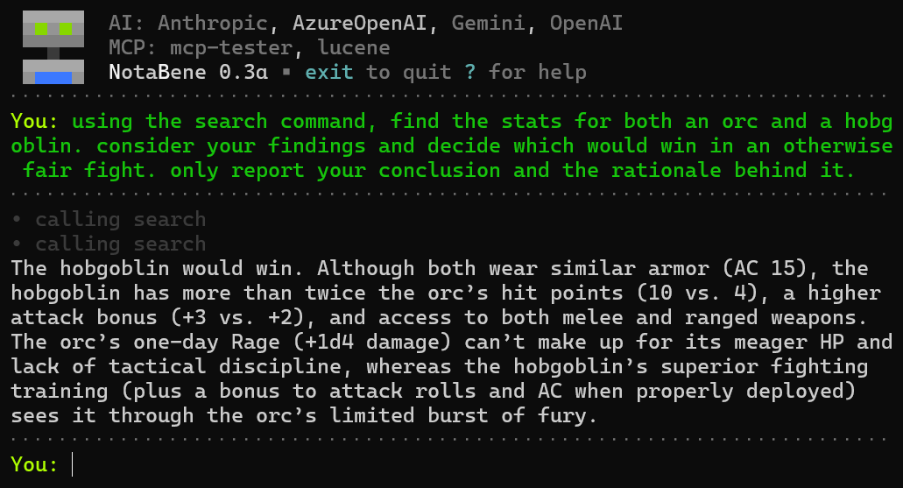

# NotaBene (nb)

A thin, terminal-native coding agent with deep shell integration, native file tools, and pluggable AI providers.



Primary use case: drop into a project directory and work interactively — read, edit, search, run builds and tests, iterate. Secondary use case: a general-purpose CLI assistant for single-shot prompts, stdin piping, scripting, and whatever else you can bolt onto it. Most of the features below support both.

## Features

- **Coding Agent Workflow**: Native file and shell tools, read-before-edit guard, project context via `NB.md`, and trust mode for friction-free iteration inside a working directory sandbox.
- **Multi-Provider AI Support**: Built-in support for Azure OpenAI (Chat Completions and Responses API), OpenAI, Anthropic Claude, and Google Gemini. Bring any Microsoft.Extensions.AI compatible model.
- **Interactive and Single-Shot Modes**: Use interactively or execute single commands. Every invocation is stateless — continuity, when you want it, is explicit (capture `--output jsonl`, replay with `--seed`).
- **Conversation Programs**: Script configuration, fabricated history, and the live prompt as one directive document (`--program`), with reusable envelope prefixes (`--spec`) and machine-readable output (`--output jsonl`/`porcelain`).
- **Terminal Integration**: Native shell access with approval UX. Models can execute commands, with dangerous operations requiring explicit confirmation.
- **Native File Tools**: Cross-platform `read_file`, `write_file`, `edit_file`, `find_files`, `grep`, `list_dir`, and `fetch_url` — read-only tools auto-approve within the working directory.
- **Trust Mode**: `--trust` auto-approves file tools and safe shell commands within the working directory sandbox.
- **File Insertion** (PDF, TXT, MD, JPG, PNG) with multimodal support for vision-capable models
- **MCP Server Integration** for extensible tools and resources
- **Line Editor**: Full editing capabilities with history, backslash continuation, and `/edit` for composing in `$EDITOR`
- **Project Context**: Auto-loads `NB.md` from your working directory to provide project-specific context

## Prerequisites

- .NET 10.0 or later
- API key for at least one supported AI provider:
  - Azure OpenAI
  - OpenAI
  - Anthropic Claude
  - Google Gemini

## Installation

### Requirements

- .NET 10 SDK (to build from source) or .NET 10 runtime (for pre-built binaries)
- **Windows only:** [Git for Windows](https://git-scm.com/download/win) — nb uses Git Bash for its shell tool on Windows. PowerShell is not supported, because models mix bash and PowerShell idioms when given a tool named `bash` and produce broken commands. If `bash.exe` isn't found at install time, nb will tell you where to get it.

### Option 1: Build from Source (Recommended)

1. Clone and configure:
   ```bash
   git clone https://github.com/breitreiter/nb
   cd nb
   cp appsettings.example.json appsettings.json
   ```

2. Edit `appsettings.json` with your AI provider configuration.

3. Build and run:
   ```bash
   dotnet build
   cd bin/Debug/net10.0
   ./nb
   ```

   **Note:** nb must run from the bin directory where provider DLLs are located.

### Option 2: Pre-built Binaries

Pre-built binaries are available in the [releases section](https://github.com/breitreiter/nb/releases), but they are not code-signed. This means you'll encounter security warnings on both Windows and macOS.

#### Windows

Windows Defender SmartScreen will warn you about running an unsigned application. Click "More info" then "Run anyway" to proceed. See Microsoft's [SmartScreen documentation](https://learn.microsoft.com/en-us/windows/security/operating-system-security/virus-and-threat-protection/microsoft-defender-smartscreen/) for more information.

#### macOS

macOS Gatekeeper will block unsigned applications. See Apple's guide on [safely opening apps on your Mac](https://support.apple.com/en-us/102445) for instructions on how to run unsigned applications.

## Configuration

After installation, configure nb for your environment:

1. **AI Provider**: Edit `appsettings.json` with your API keys and endpoints. You can configure multiple providers and switch between them at runtime, but you only need to start with one. nb supports local models via HTTP. If your model doesn't have a standard context window size, you'll need to set the `MaxContextTokens` value in `appsettings.json`. nb ships with several prompt extensions for common model, but you can also add your own.

2. **System Prompt** (Optional): Edit `system.md` to customize the default system prompt.

3. **MCP Servers** (Optional): Copy `mcp.example.json` to `mcp.json` and configure your MCP server connections.

4. **Theme** (Optional): Customize colors by editing `theme.json`.

#### Config resolution

Configuration resolves in layers, later winning: install defaults (`appsettings.json` next to the binary) → user config (`~/.config/nb/config.json`, honoring `XDG_CONFIG_HOME`) → the nearest project `.nb/config.json` (found by walking up from the current directory) → `NB_`-prefixed environment variables (`NB_ActiveProvider`, `NB_ChatProviders__0__ApiKey`, …). This keeps API keys out of the install directory and lets a project or CI job set provider/model without editing shared config. Pass `--config <file>` to use a single config file hermetically (ignoring the layers) — handy for isolated test runs.

## Usage

### Interactive Mode
Launch with no parameters to start an interactive chat session:
```bash
nb
```

In interactive mode, you can:
- Type naturally to chat with the AI
- Type `/` to see available slash commands
- Type `//` to cancel and go back
- Use backslash (`\`) at end of line to continue on next line
- Press up/down arrows for command history

### Slash Commands

| Command | Description |
|---------|-------------|
| `/clear` | Clear conversation history (preserves system prompt) |
| `/edit` | Compose message in `$EDITOR` |
| `/provider` | Switch AI provider |
| `/tools` | List available tools by source, with approval status |
| `/quit` | Exit nb |

### Single-Shot Mode
Launch with parameters to execute a single command and exit immediately:
```bash
nb /clear
nb Summarize this document
```

Text piped to stdin is treated as conversation context. nb will read stdin to completion before continuing.
```bash
echo "the air in spring is fresh and clean" | nb "write a sentence that rhymes with this, to create a couplet"
```

**Every invocation is stateless** — nb reads and writes no history file, so parallel runs in the same directory just work. When you want continuity, pass it explicitly: capture a run's transcript and hand it back as the premise for the next one.
```bash
nb --output jsonl "start a haiku about autumn" > turn1.jsonl
nb --seed turn1.jsonl "now finish it"
```

nb exposes the current working directory as an MCP root, to help filesystem MCP servers orient themselves.

### Machine-Readable Output

Two output modes route the model's answer to stdout and all chrome (banners, spinner, tool logs) to stderr, so a script can capture a clean result:

```bash
nb --output jsonl "…"        # a typed event stream (user/assistant_text/tool_call/… + a result trailer)
nb --output porcelain "…"    # plain text: TOOL/RESULT lines + the answer verbatim (fenced blocks survive)
```

Color is disabled automatically when stdout is redirected or `NO_COLOR` is set. The process exit code is meaningful: `0` success, `2` provider error, `3` turn aborted (tool-call budget or repeated failures), `4` approval denied.

### Conversation Programs

A **conversation-program** is an ordered list of directives that builds a conversation and invokes the model — nb's scripting surface, where configuration, fabricated history, and the live prompt are one document instead of three mechanisms.

```
provider anthropic
model claude-sonnet-5
system you are a terse assistant
user what's 2+2?
assistant 4
run and what's the square of that?
```

```bash
nb --program flow.nb          # from a file
nb --program - < flow.nb      # from stdin (a first '{' char is read as jsonl bytecode instead)
```

Each line is `<verb> <content>`. **Config directives** (`provider`, `model`, `output`, `mcp`, `tools`) set the envelope going forward; **turn directives** (`system`, `user`, `assistant`) append messages; **`run`** invokes the model on the accumulated state (`run <text>` is shorthand for a `user` turn then `run`). Because config directives can appear between runs, one file can drive two models:

```
model haiku
run quick triage of this log
model opus
run now analyze the root cause
```

A trailing `\` continues content onto the next line, `#` lines are comments, and `@file` as a directive's whole content includes that file. A program is never given nb's default persona — it gets exactly the `system` directives it writes (nothing, if it writes none), which is what an eval harness wants. Programs default to `--output jsonl`.

A JSONL (bytecode) program can additionally fabricate a **tool round** as premise — `tool_call` and its matching `tool_result` events — which is loaded into history exactly as a `--seed` transcript is (a turn's assistant text and its calls batch into one message; every call must have a result before the run that consumes it). These aren't live invocations; they're recorded rounds you're replaying into the model's view. The source syntax has no verb for them.

The `tools` and `mcp` directives reshape the tool surface, with delta tokens (`+name`, `-name`, or the lone `none`):

```
tools -bash        # drop one native tool (bash, read_file, write_file, edit_file, find_files, grep, list_dir, apply_patch, fetch_url)
tools none         # no native tools this run
mcp +figma         # expose the figma MCP server's tools
```

Native tools are **all-on** by default; a `tools` directive filters them. MCP servers are **strict-empty** for a program: a program exposes no MCP tools unless it names servers with `mcp +server` (the bare `nb "prompt"` path is unaffected — it exposes every connected server, as before). `--resolve` prints the resolved surface at each run point.

**Specs** are reusable prefixes of config directives, prepended to a program or a prompt:

```bash
nb --spec headless --program eval.nb     # prepend the built-in headless envelope (jsonl output, no persona)
nb --spec chat --program tools.nb        # opt a program into nb's default persona floor
nb --spec ./my-envelope.nb "do the task"
```

`--spec` resolves a built-in (`chat` = nb's default persona, `headless` = jsonl output), an explicit file path, or `specs/<name>.nb` in a project `.nb/` directory or `~/.config/nb/`. `chat` is the persona the bare `nb "prompt"` path uses, made requestable by name — `nb "x"` and `nb --spec chat "x"` produce a byte-identical persona. (They differ only in the MCP surface: the bare path exposes every connected server, while any program — `--spec chat` included — is strict-empty until it names servers with `mcp +server`.)

**Inspect a program without running it:**

```bash
nb --validate --program flow.nb    # parse + check (unknown provider, invalid output mode); exit 1 on error
nb --resolve  --program flow.nb    # print the effective envelope at each run point
```

The program format and the transcript format are the same schema: `--output jsonl` emits it and `--seed` loads it, so record → edit → replay is native.

### Shell Commands

Models can execute shell commands via the built-in `bash` tool. Each command requires approval before execution:

```
Run: ls -la
Execute? [Y/n/?]
```

Commands are classified for clarity (`Read`, `Write`, `Delete`, `Run`) and dangerous operations show warnings with flipped defaults:

```
Delete ⚠: /tmp/important-file
  Warning: deletes files
Execute? [y/N/?]
```

Press `?` at the approval prompt to see the full command before deciding.

For automation and scripting, pre-approve commands with the `--approve` flag:
```bash
nb --approve "ls" --approve "cat *" "analyze this project"
```

Patterns support globs (`cat *` matches `cat file.txt`, `cat /etc/hosts`, etc.).

**Auto-approved safe commands** (no prompt required):
- Build tools: `dotnet build`, `dotnet test`, `cargo build`, `make`, `npm run`, `yarn`, etc.
- Read-only git: `git status`, `git log`, `git diff`, `git show`, etc.
- Read-only queries: `which`, `whereis`, `type`, etc.

### File Tools

Models have native file tools that work cross-platform without the shell:

| Tool | Description | Approval |
|------|-------------|----------|
| `read_file` | Read file contents with line numbers | Auto in cwd, prompt outside |
| `list_dir` | Lightweight directory listing | Auto in cwd, prompt outside |
| `find_files` | Glob-based file discovery | Auto in cwd, prompt outside |
| `grep` | Regex content search | Auto in cwd, prompt outside |
| `write_file` | Create or overwrite files | Required (auto in cwd with `--trust`) |
| `edit_file` | Targeted string replacement | Required (auto in cwd with `--trust`) |
| `fetch_url` | Fetch text content from an HTTP/HTTPS URL | Always required |

Read tools auto-approve inside the working directory sandbox (and system temp dirs); paths outside prompt for approval. Write tools always prompt unless `--trust` is active. `fetch_url` always prompts — outbound network is a separate trust boundary.

**Read-before-edit guard**: The `edit_file` and `write_file` tools enforce that files must be read via `read_file` before modification, helping prevent the model from making blind edits.

### Trust Mode

Auto-approve file tools and non-dangerous shell commands within the working directory:

```bash
nb --trust "refactor the auth module"
```

Or enable permanently in `appsettings.json`:
```json
{ "Trust": true }
```

**Sandboxed**: only operations targeting the cwd (and system temp dirs) are auto-approved. Dangerous commands (`rm -rf`, `sudo`, etc.) always prompt. Also bumps the max tool calls per message to 50.

### Listing Tools

`/tools` shows every tool currently exposed to the model, grouped by source (native, MCP servers, resources, todo), with each tool's approval status:

- `auto (cwd)` — read-only file tools; auto-approved inside the working-directory sandbox
- `auto (trust)` — writes and bash; auto-approved only when `--trust` is active
- `auto (always-allow)` — MCP tools listed in their server's `alwaysAllow`
- `prompt` — asks for approval on each call

### Command-Line Flags

| Flag | Description |
|------|-------------|
| `--approve <pattern>` | Pre-approve shell commands matching the glob pattern |
| `--trust` | Auto-approve file tools and safe bash commands within cwd |
| `--system <path>` | Load system prompt from a custom file |
| `--nobash` | Disable all shell and file tools |
| `--verbose` | Log tool call inputs and outputs (useful for debugging) |
| `--dump-tools` | Write MCP tool manifest to `mcp-tools.json` and exit |
| `--output <mode>` | `interactive` (default), `porcelain`, or `jsonl` — see [Machine-Readable Output](#machine-readable-output) |
| `--config <file>` | Use a single config file hermetically, ignoring the layered resolution |
| `--seed <file>` | Load a jsonl transcript as premise history before the prompt runs |
| `--program <file>` | Evaluate a conversation-program (`-` for stdin) — see [Conversation Programs](#conversation-programs) |
| `--spec <name\|file>` | Prepend a reusable config-directive prefix (built-in `chat`/`headless`, a path, or `specs/<name>.nb`) |
| `--validate` | Parse and check a program/spec, run nothing (exit 1 on error) |
| `--resolve` | Print the effective envelope at each run point, run nothing |

Example combining flags:
```bash
nb --verbose --nobash --system eval-prompt.txt "run the evaluation"
```

### Provider Switching
Switch between AI providers during a conversation to leverage different models' strengths:
```bash
/provider                 # Interactive selection menu
```

Conversation history is maintained when switching providers, allowing you to continue the same conversation with different AI models.

### MCP Configuration
Configure MCP servers in `mcp.json`:
```json
{
  "servers": {
    "my-server": {
      "type": "stdio",
      "command": "my-mcp-server",
      "args": ["--some-flag"],
      "alwaysAllow": ["tool1", "tool2"]
    }
  }
}
```

The `alwaysAllow` array specifies tools that skip approval prompts. Use `["*"]` to auto-approve all tools from a server (useful for automation):
```json
"alwaysAllow": ["*"]
```

### Built-in MCP Server
The project includes a test server (`mcp-servers/mcp-tester/`) with basic tools.

### Fake Tools
nb will read `fake-tools.yaml` and treat those definitions as normal tools. When the model requests a fake tool, nb will return the configured response. Refer to `fake-tools.example.yaml` for the expected format.

Fake tool definitions will override MCP definitions. This is by design, to allow you to fake destructive actions or quickly tune tool descriptions for alignment testing.

#### Response Macros
Responses support macros for dynamic values, so each invocation produces fresh data instead of identical static strings:

| Macro | Description | Example |
|-------|-------------|---------|
| `{{$guid}}` | Random UUID | `a3b1c2d4-...` |
| `{{$timestamp}}` | Current UTC time (ISO 8601) | `2026-02-25T14:30:00Z` |
| `{{$int}}` | Random integer | `483291` |
| `{{$int(1,100)}}` | Random integer in range | `42` |
| `{{$counter.name}}` | Auto-incrementing counter | `1`, `2`, `3`... |
| `{{$param.fieldname}}` | Echo back a tool argument | value of `fieldname` |
| `{{$choice(a,b,c)}}` | Random pick from list | `b` |
| `{{$random_string}}` | Random alphanumeric (8 chars) | `xK9mPq2r` |
| `{{$random_string(16)}}` | Random alphanumeric (custom length) | `xK9mPq2rT5nLw8yZ` |

Example response template:
```yaml
response: '{"id": "{{$guid}}", "status": "{{$choice(pending,active,completed)}}", "created_at": "{{$timestamp}}"}'
```

## Project Context

If you create an `NB.md` file in your working directory, nb will automatically load it and include it in the system prompt. This is perfect for providing project-specific context, coding conventions, architecture notes, or any other information the AI should know about your project.

nb will search upward through parent directories to find `NB.md`, so you can place it at your project root and it will be available in subdirectories.

Other context files may be hinted at if found (e.g., `CLAUDE.md`, `AGENTS.md`), but only `NB.md` auto-loads.

## Theming

nb loads its color scheme from `theme.json` at startup. Color names are from [Spectre.Console](https://spectreconsole.net/appendix/colors)

For example, here's a high-contrast theme (WCAG AAA on standard Windows console background #0C0C0C):

```json
{
  "Success": "lime",
  "Error": "red",
  "Warning": "yellow",
  "Info": "white",
  "Muted": "grey70",
  "Accent": "aqua",
  "UserPrompt": "lime",
  "FakeTool": "magenta"
}
```

## Building for Distribution

```bash
dotnet publish -c Release -r win-x64 --self-contained
```

Include `system.md`, `mcp.json`, and `theme.json` with your executable for custom configurations.

## AI Provider Architecture

nb includes several built-in AI providers and supports extensibility for additional services:

### Built-in Providers
- **AzureOpenAI** - Chat Completions on classic Azure OpenAI resources
- **AzureFoundry** - Responses API on classic Azure OpenAI resources (needed for codex-family models like `gpt-5-codex`, and any other Responses-API-only model)
- **OpenAI** - Direct OpenAI API integration
- **Anthropic** - Claude models with function calling support
- **Google Gemini** - Google's generative AI models
- **Mock** - Testing provider that requires no API key

#### Which Azure provider do I want?

Azure's product surface spans several ways to expose a model. If you're unsure, match the API shape your deployment exposes:

| Your deployment URL looks like... | Use provider |
|---|---|
| `https://<name>.{openai.azure.com,cognitiveservices.azure.com}/openai/deployments/<name>/chat/completions?...` | `AzureOpenAI` |
| `https://<name>.{openai.azure.com,cognitiveservices.azure.com}/openai/responses?...` | `AzureFoundry` |

Both providers accept either the resource root (`https://<name>.cognitiveservices.azure.com/`) or the full deployment URL in the `Endpoint` field — the plugin strips to the host. The `Model` field is your **deployment name** (what you named it at deploy time), not the model family name.

If Azure shows you an endpoint on `services.ai.azure.com` with a `/api/projects/<project>/...` path, that's the newer Foundry Unified Endpoint and neither current provider targets it directly — open an issue if you need that variant.

All providers are automatically compiled into the `bin/{Config}/net10.0/providers/` directory during build.

The Mock provider returns "OK" by default, or the value of the `Response` config key. You can also control responses inline by prefixing your message with `MOCK:response=<text>`.

### Provider Extensibility

nb uses a pluggable provider architecture built on Microsoft.Extensions.AI. The repo includes 4 common providers, but you can roll your own.

1. Create a new project and add the NuGet package:
   ```bash
   dotnet add package nb.Providers.Abstractions
   ```
2. Implement the `IChatClientProvider` interface, which requires you to supply an instance of `IChatClient` from Microsoft.Extensions.AI plus some basic configuration tooling.
3. Build and copy your assembly to a new subdirectory under `providers/`
4. Add any required configuration to appsettings.json.

See the [nb.Providers.Abstractions](https://www.nuget.org/packages/nb.Providers.Abstractions) package for full documentation and examples.

## License

MIT License
